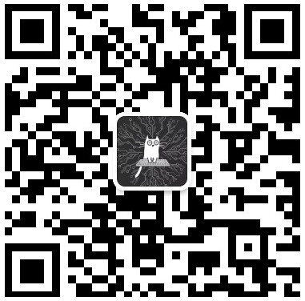

#基于Tomcat+Servlet的个人微信公众号服务后台

## 博客地址：
<http://www.jianshu.com/u/bf03aa158e75>

##实现功能：
* 完成微信个人公众号的服务器地址绑定；
* 完成微信个人公众号的消息解析；
* 支持微信的文本输入；
* 支持微信的语言输入；
* 接入Turing机器人接口；
* 实现基于HtmlParser的web页面爬取和内容分析；

##测试公众号:

##测试方法：

###Turing接口测试
* 文本输入“今天天气怎么样？”

###语音输入测试
* 语音输入“今天天气怎么样？”

###自定义指令测试（web页面内容爬取）
* 文本或语音输入“我的简书文章有哪些？”